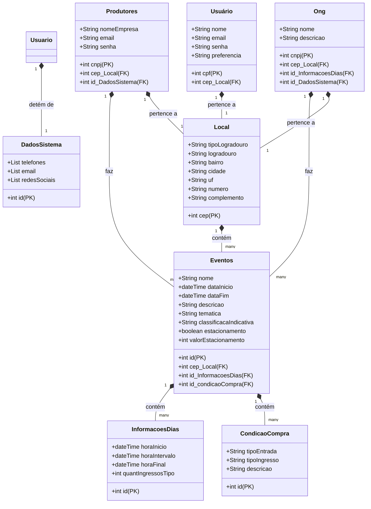

### Diagrama de Entidade Relacionamento [DER]

```mermaid
classDiagram
    class Usuário {
        +int cpf (PK)
        +String nome
        +String email
        +String senha
        +int cep_Local (FK)
        +String preferencia
    }

    class Produtores {
        +int cnpj (PK)
        +String nomeEmpresa
        +String email
        +String senha
        +int cep_Local (FK)
        +int id_DadosSistema (FK)
    }

    class Eventos {
        +int id (PK)
        +String nome
        +dateTime dataInicio
        +dateTime dataFim
        +String descricao
        +String tematica
        +String classificacaIndicativa
        +boolean estacionamento
        +int valorEstacionamento
        +int cep_Local (FK)
        +int id_InformacoesDias (FK)
        +int id_condicaoCompra (FK)
    }

    class Ong {
        +int cnpj (PK)
        +String nome
        +String descricao
        +int cep_Local (FK)
        +int id_InformacoesDias (FK)
        +int id_DadosSistema (FK)
    }

    class Local {
        +int cep (PK)
        +String tipoLogradouro
        +String logradouro
        +String bairro
        +String cidade
        +String uf
        +String numero
        +String complemento
    }

    class InformacoesDias {
        +int id (PK)
        +dateTime horaInicio
        +dateTime horaIntervalo
        +dateTime horaFinal
        +int quantIngressosTipo
    }

    class CondicaoCompra {
        +int id (PK)
        +String tipoEntrada
        +String tipoIngresso
        +String descricao
    }

    class DadosSistema {
        +int id (PK)
        +List<int> telefones
        +List<String> email
        +List<String> redesSociais
    }
    
    
Produtores "1" *-- "many" Eventos : faz
    Ong "1" *-- "many" Eventos : faz
    Usuário "1" *-- "1" Local : pertence a
    Ong "1" *-- "1" Local : pertence a
    Produtores "1" *-- "1" Local : pertence a
    Local "1" *-- "many" Eventos : contém
    Eventos "1" *-- "many" InformacoesDias : contém
    Eventos "1" *-- "many" CondicaoCompra : contém
    Usuario "1" *-- "1" DadosSistema : detém de

```
classificação indicativa
dados da empresa (comunicação, redes sociais)
estacionamento
valor do estacionamento
